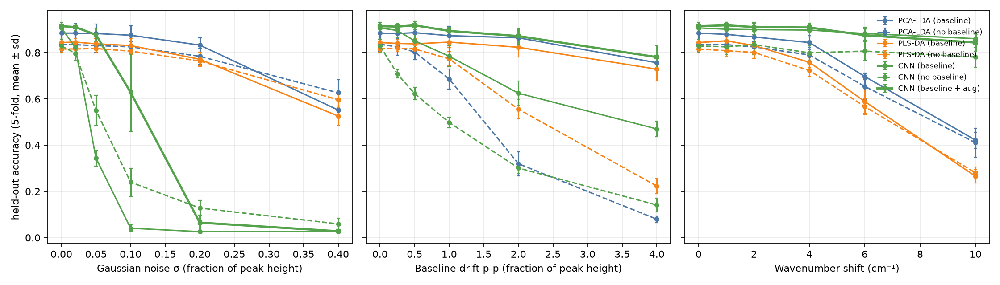

# Raman Mineral Classifier

Identify minerals from Raman spectra (RRUFF public database) with baseline correction, PCA-LDA,
PLS-DA and a 1D CNN. Cross-validation is grouped by specimen, and every model is stress-tested
with simulated instrument noise, baseline drift and wavenumber miscalibration.

## Data
RRUFF Raman library, raw (uncorrected) 532 nm spectra, 180-1280 cm^-1 resampled to a 2 cm^-1 grid.
Kept minerals with at least 5 distinct specimens: **70 minerals, 538 spectra, 536 specimens**.

Grouping caveat: RRUFF mostly measures each specimen once per laser, so only 2 specimens have two spectra.
The grouped split is enforced (asserted in code) but it prevents little leakage here. It would matter
more with the oriented/repeat-measurement data or a larger multi-laser set.

## Pipeline
1. Savitzky-Golay smoothing, then **AsLS baseline correction** (lam=1e5, p=0.01), clip at 0, scale to max 1.
2. Models: **PCA(40)+shrinkage LDA**, **PLS-DA** (latent variables chosen by inner CV), **1D CNN**
   (3 conv blocks, 60 epochs, AdamW + one-cycle, label smoothing).
3. 5-fold `StratifiedGroupKFold` (groups = RRUFF specimen ID). Mean +- sd over folds.
4. Ablation: same models with no baseline correction. CNN variant trained with augmented copies
   (noise <= 5 %, drift <= 1.0, shift <= 4 cm^-1; 8 copies per spectrum).
5. Robustness: perturb the *raw* held-out spectra, then rerun the full preprocessing + model.
   Noise sigma and drift amplitude are relative to the peak height; shift is a random-sign
   global wavenumber offset. Models are trained on clean data only (except the aug CNN).

## Results (held-out, 5-fold)
| Model | Accuracy | Macro-F1 |
|---|---|---|
| PCA-LDA (baseline) | 0.885 +- 0.045 | 0.862 |
| PLS-DA (baseline) | 0.844 +- 0.015 | 0.799 |
| CNN (baseline) | 0.907 +- 0.025 | 0.894 |
| CNN (baseline + aug) | **0.915 +- 0.007** | 0.901 |
| PCA-LDA (no baseline) | 0.836 +- 0.032 | 0.825 |
| PLS-DA (no baseline) | 0.816 +- 0.014 | 0.773 |
| CNN (no baseline) | 0.829 +- 0.030 | 0.800 |

Baseline correction adds 3-8 accuracy points to every model. Chance is about 1.4 %.

| Accuracy at... | PCA-LDA | PLS-DA | CNN | CNN + aug |
|---|---|---|---|---|
| drift 1.0 x peak height | 0.874 | 0.846 | 0.784 | 0.894 |
| drift 2.0 | 0.864 | 0.823 | 0.625 | 0.872 |
| shift 6 cm^-1 | 0.697 | 0.589 | 0.883 | 0.876 |
| shift 10 cm^-1 | 0.422 | 0.266 | 0.861 | 0.844 |
| noise 0.10 | 0.875 | 0.831 | 0.041 | 0.629 |
| noise 0.20 | 0.833 | 0.771 | 0.026 | 0.065 |

Full tables: `results/robustness_tables.md`, `results/clean_summary.csv`.

